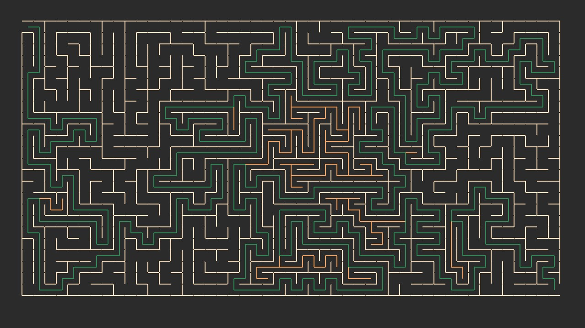

# Maze Solver

This projects was done following the corresponding [boot.dev project](https://www.boot.dev/learn/build-maze-solver-python)

Currently it uses DFS for both maze generation and solver.

My plans are to add an UI and allow to select the preferred algorithm (DFS or BFS), change cell size, change color palette and to be responsive to the monitor resolution.

